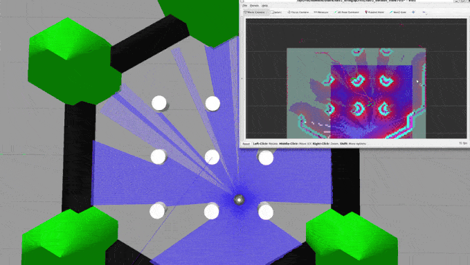

# TurtleBot3 Navigation in Gazebo using ROS2 and Docker
## About
This project demonstrates autonomous navigation of a TurtleBot3 in a Gazebo simulation using ROS2 and Navigation 2 (Nav2). The primary goal is to minimize setup complexity while maintaining minimal functionality.

## Prerequisites
- Ubuntu 22.04+
- Docker and Docker Compose installed (follow the [official guilde](https://docs.docker.com/engine/install/ubuntu/))
- (Optional) If you're using an NVIDIA GPU, ensure the NVIDIA Container Toolkit is installed for hardware acceleration. Refer to the [NVIDIA Container Toolkit guide](https://docs.nvidia.com/datacenter/cloud-native/container-toolkit/install-guide.html).

## Setup
1. clone the repository and navigate to the project folder
```bash
git clone https://github.com/shaoanlu/turtlebot3_sim_nav2.git
cd turtlebot3_sim_nav2
```
2. Build the Docker image
```bash
docker compose build
```
3. Run the containers
```bash
# Containers
#    turtlebot3_sim: The robot simulator
#    nav_controller: Controller based on nav2 (turtlebot3-navigation2)
#    auto_navigation: A ROS2 node that randomly publishes goal positions for the robot to follow.
docker compoer up
```
4. (Optional) Stop the container
```bash
docker compoer stop
```

## Execution Results
The following animation demonstrates the execution of the project:
- The Gazebo window displays the TurtleBot3 robot navigating in the standard simulation world.
- The RViz window visualizes the SLAM map and the navigation progress.



## Problems Encountered and Solutions
### 1. Gazebo Window Does Not Display Properly
Encounter a black screen or no Gazebo window after running `ros2 launch turtlebot3_gazebo turtlebot3_world.launch.py`

#### Solution: Update docker-compose.yaml Configuration
Add the following environment variables and volumes to enable graphical support in Docker:
```yaml
    environment:
      # Needed to define a TurtleBot3 model type
      - TURTLEBOT3_MODEL=burger
      # Allows graphical programs in the container.
      - DISPLAY=${DISPLAY}
      - QT_X11_NO_MITSHM=1
      - NVIDIA_DRIVER_CAPABILITIES=all
      - GAZEBO_MODEL_PATH=$GAZEBO_MODEL_PATH:/opt/ros/humble/share/turtlebot3_gazebo/models
    volumes:
      # Allows graphical programs in the container.
      - /tmp/.X11-unix:/tmp/.X11-unix:rw
      - ${XAUTHORITY:-$HOME/.Xauthority}:/root/.Xauthority
```
and ensure the command includes the necessary Gazebo setup sourcing:
```yaml
    command: >
      bash -c "source /opt/ros/humble/setup.bash &&
               source /usr/share/gazebo/setup.bash &&
               ros2 launch turtlebot3_gazebo turtlebot3_world.launch.py"
```
